# Overview of Modern AI

Modern AI is best understood as a set of overlapping problem framings rather than a single ladder of methods. Some branches focus on prediction, some on uncertainty, some on hidden structure, some on decision-making, some on generation, and some on operating these models reliably in the world.

The same real system often combines many of them. A search assistant may use retrieval, ranking, embeddings, LLM generation, calibration, experimentation, privacy constraints, and production monitoring. A recommender may use supervised learning, matrix factorization, sequence models, bandits, causal evaluation, and ML systems infrastructure.

## Field Connection Diagram

The diagram below treats each area as a problem framing. The edge labels name the shared concepts that make the connection useful in real systems.

```mermaid
flowchart LR
  subgraph Predict["Prediction and supervised structure"]
    SL["Supervised Learning<br/>labels -> prediction"]
    TE["Trees, Ensembles,<br/>and Tabular ML"]
  end

  subgraph Prob["Uncertainty and hidden structure"]
    PM["Probabilistic Modeling<br/>uncertainty -> inference"]
    GLV["Graphical Models<br/>and Latent Variables"]
    SAI["Sampling and<br/>Approximate Inference"]
  end

  subgraph Rep["Representations and neural function approximation"]
    RLN["Representation Learning<br/>features -> embeddings"]
    DL["Deep Learning<br/>differentiable models"]
    SEQ["Sequence, Time-Series,<br/>and State Models"]
  end

  subgraph Decision["Selection, generation, and action"]
    RLB["Reinforcement Learning<br/>and Bandits"]
    IRR["Information Retrieval,<br/>Ranking, and Recommenders"]
    GEN["Generative AI<br/>and Foundation Models"]
    CI["Causal Inference<br/>and Experimentation"]
  end

  subgraph Operate["Operation and constraints"]
    MLS["ML Systems<br/>and MLOps"]
    RAI["Responsible, Private,<br/>and Robust AI"]
  end

  SL -->|specialized supervised models<br/>for structured data| TE
  SL -->|losses, likelihoods,<br/>calibration, priors| PM
  SL -->|neural predictors<br/>learn features| DL
  SL -->|pointwise, pairwise,<br/>and listwise relevance| IRR
  SL -->|prediction can guide<br/>but not prove interventions| CI

  TE -->|GBDT baselines,<br/>tabular production data| MLS
  TE -->|LambdaMART and<br/>boosted rankers| IRR
  TE -->|leaf indices can become<br/>downstream features| RLN

  PM -->|hidden variables,<br/>dependency assumptions| GLV
  PM -->|posteriors and expectations<br/>need approximation| SAI
  PM -->|explicit data distributions<br/>enable generation| GEN
  PM -->|uncertainty-aware<br/>decision-making| RLB
  PM -->|calibration, risk,<br/>and noisy labels| SL

  GLV -->|HMMs and state-space<br/>models use latent state| SEQ
  GLV -->|matrix factorization<br/>and latent factors| IRR
  GLV -->|VAEs combine latent variables<br/>with neural decoders| GEN
  GLV -->|structured hidden codes| RLN

  SAI -->|Monte Carlo estimates<br/>future trajectory values| RLB
  SAI -->|generation is sampling from<br/>learned distributions| GEN
  SAI -->|VI and amortized inference<br/>train VAEs| RLN

  RLN -->|embeddings and features<br/>for downstream models| SL
  RLN -->|hidden layers scale<br/>feature learning| DL
  RLN -->|dense retrieval and<br/>two-tower embeddings| IRR
  RLN -->|pretraining, contrastive learning,<br/>and multimodal embeddings| GEN

  DL -->|RNNs, LSTMs,<br/>attention, transformers| SEQ
  DL -->|transformers, diffusion,<br/>GANs, VAEs| GEN
  DL -->|deep rankers and<br/>neural retrieval| IRR
  DL -->|policies and value functions<br/>as neural approximators| RLB
  DL -->|model size, latency,<br/>and serving cost| MLS

  SEQ -->|state transitions<br/>define MDP dynamics| RLB
  SEQ -->|session and next-item<br/>recommendation| IRR
  SEQ -->|autoregressive token<br/>and time-step prediction| GEN

  RLB -->|exploration in recommendations,<br/>ads, and personalization| IRR
  RLB -->|preference optimization<br/>and RLHF| GEN
  RLB -->|policies create interventions<br/>and logged-data bias| CI

  IRR -->|RAG grounds generation<br/>with retrieved context| GEN
  IRR -->|logged feedback, position bias,<br/>counterfactual evaluation| CI
  IRR -->|ANN search, serving,<br/>metrics, feedback loops| MLS

  GEN -->|LLM products need<br/>evaluation and serving| MLS
  GEN -->|hallucination, prompt injection,<br/>misuse, alignment| RAI

  CI -->|A/B tests and guardrails<br/>validate product impact| MLS
  CI -->|fairness, harm, and policy<br/>need causal measurement| RAI

  MLS -->|monitoring, privacy review,<br/>rollback, governance| RAI
  RAI -->|constraints shape data,<br/>training, evaluation, serving| MLS
```

## Supervised Learning

Supervised learning is the classical foundation: learn a mapping from inputs to labels using examples. It includes regression, classification, ranking-style scoring, logistic regression, SVMs, trees, ensembles, and supervised neural networks.

Its central question is:

> Given labeled examples, how do we predict the right output for a new input?

Supervised learning connects to almost everything else. Deep learning is often supervised learning with learned representations. Ranking can be framed as supervised relevance prediction. Probabilistic modeling provides likelihood-based interpretations of losses. Causal inference warns that predictive accuracy does not imply an intervention will work.

## Trees, Ensembles, and Tabular ML

Trees and ensembles are a major subfield of supervised learning, especially for structured data. Decision trees provide interpretable rules; random forests reduce variance through averaging; gradient boosted trees build strong predictors by sequentially correcting errors.

They are closely linked to production ML because tabular business, product, and risk data remain common. They also provide strong baselines against deep models. In ranking, methods like LambdaMART connect boosted trees directly to learning-to-rank.

## Probabilistic Modeling

Probabilistic modeling represents uncertainty explicitly. Instead of only learning a prediction function, it defines a probability model for data, labels, hidden variables, parameters, or future outcomes.

Its central question is:

> What uncertain process could have generated the observed data, and what can we infer from it?

This branch includes likelihoods, priors, posteriors, Bayesian inference, Naive Bayes, mixture models, probabilistic matrix factorization, and uncertainty-aware prediction.

Probabilistic modeling is linked to supervised learning through losses and calibration, to generative modeling through explicit data distributions, to latent variable models through hidden structure, and to decision-making through uncertainty-aware actions.

## Graphical Models and Latent Variables

Graphical models use graph structure to represent dependencies between variables. Latent variable models introduce hidden factors that explain observations.

Examples include Bayesian networks, Markov random fields, Gaussian mixture models, topic models, HMMs, probabilistic matrix factorization, and VAEs.

This field is a bridge between probability, representation learning, and sequences. A recommender's user and item embeddings can be viewed as latent factors. An HMM models a hidden state evolving over time. A VAE combines neural networks with probabilistic latent variables.

## Sampling and Approximate Inference

Many probabilistic models are easy to write down but hard to compute with exactly. Sampling and approximate inference provide practical ways to estimate probabilities, expectations, or posterior distributions.

This branch includes Monte Carlo methods, importance sampling, MCMC, Gibbs sampling, Metropolis-Hastings, Hamiltonian Monte Carlo, and variational inference.

Sampling is connected to probabilistic modeling because it often solves the inference problem those models create. It is connected to generative AI because generation itself can be viewed as sampling from a learned distribution. It is connected to RL because policy evaluation and planning often require estimating expectations over future trajectories.

## Representation Learning

Representation learning is about learning useful features from data. It includes PCA, matrix factorization, embeddings, autoencoders, VAEs, contrastive learning, and self-supervised learning.

Its central question is:

> What compressed or transformed representation makes downstream learning easier?

Representation learning links classical ML to modern deep learning. Matrix factorization learns user and item representations for recommenders. Autoencoders learn compact latent codes. Contrastive learning powers image-text embeddings, dense retrieval, and multimodal models. Self-supervised learning made foundation models possible by extracting training signal from raw data.

## Deep Learning

Deep learning uses layered differentiable models trained with gradient-based optimization. It is less a single application area and more a modeling toolkit for images, text, audio, sequences, graphs, ranking, generation, and control.

Core ideas include neural networks, backpropagation, embeddings, convolution, recurrence, attention, transformers, normalization, regularization, transfer learning, and scaling.

Deep learning connects strongly to representation learning because hidden layers learn features. It connects to generative AI through transformers, diffusion models, VAEs, and GANs. It connects to supervised learning through standard predictive training, and to RL through deep function approximation for policies and value functions.

## Sequence, Time-Series, and State Models

Sequence and state models handle ordered data and evolving systems. They include Markov chains, HMMs, state-space models, Kalman filters, RNNs, LSTMs, temporal convolution models, transformers, and time-series forecasting methods.

Their central question is:

> How does the current or hidden state evolve over time, and how does history affect the next outcome?

This branch connects probabilistic modeling to deep learning. Markov chains and HMMs are probabilistic state models. RNNs and transformers are neural sequence models. RL uses state transitions as a core abstraction. Recommender systems use sequence models for session-based and next-item prediction.

## Reinforcement Learning and Bandits

Reinforcement learning studies agents that choose actions, receive rewards, and affect future states. Bandits are a simpler version focused on exploration and exploitation, often without long-term state dynamics.

Its central question is:

> What action should an agent take to maximize reward over time?

This branch includes MDPs, policies, value functions, Q-learning, policy gradients, actor-critic methods, contextual bandits, offline RL, and RLHF.

RL links to supervised learning through function approximation, to causal inference through interventions, to sequence modeling through state transitions, and to recommendation through exploration. RLHF links reinforcement learning, ranking, preference modeling, and generative AI.

## Information Retrieval, Ranking, and Recommenders

Retrieval finds candidates from a large collection. Ranking orders them. Recommendation personalizes selection and ordering based on user, item, context, and behavior.

This branch includes lexical retrieval, dense retrieval, approximate nearest neighbor search, learning-to-rank, collaborative filtering, matrix factorization, two-tower models, deep rankers, sequential recommendation, and reranking.

It is one of the most connected applied AI areas. It uses supervised learning for relevance prediction, representation learning for embeddings, probabilistic latent factors for collaborative filtering, sequence models for user histories, bandits for exploration, and causal inference for logged feedback bias. Retrieval also became central to GenAI through RAG.

## Generative AI and Foundation Models

Generative AI models produce new content: text, code, images, audio, video, structured outputs, or actions. Foundation models are large pretrained models adapted to many tasks.

This branch includes autoregressive language models, diffusion models, VAEs, GANs, flow models, multimodal models, instruction tuning, preference tuning, RAG, tool use, and LLM evaluation.

Generative AI links to probabilistic modeling because generation means sampling from a learned distribution. It links to representation learning through pretraining and embeddings. It links to retrieval through grounding and RAG. It links to RL through preference optimization and RLHF. It links to ML systems because inference cost, latency, safety, and evaluation are often the bottlenecks.

## Causal Inference and Experimentation

Causal inference asks what would happen under an intervention. This is different from predicting what will happen under the current system.

Its central question is:

> Did an action cause an outcome, and what would happen if we changed the action?

This branch includes randomized experiments, causal graphs, potential outcomes, treatment effects, propensity scores, instrumental variables, difference-in-differences, uplift modeling, and counterfactual evaluation.

Causal inference is linked to supervised learning because predictive models are often used to choose interventions, but prediction alone can be misleading. It is linked to recommendation and ranking through logging bias and counterfactual evaluation. It is linked to RL and bandits because policies change what data is observed.

## ML Systems and MLOps

ML systems turn models into reliable products. This branch includes data pipelines, feature stores, training infrastructure, evaluation pipelines, model registries, serving, inference optimization, monitoring, retraining, rollback, and incident response.

Its central question is:

> How do we make ML work reliably, safely, and efficiently outside a notebook?

ML systems connect to every modeling branch. A model is only useful if the data is fresh, features match training, evaluation reflects product goals, serving meets latency and cost constraints, and failures are observable. Modern AI systems also require versioning, privacy review, safety evaluation, and continuous monitoring.

## Responsible, Private, and Robust AI

Responsible AI studies the social and technical risks of model behavior. It includes fairness, privacy, interpretability, robustness, security, safety, governance, and human oversight.

This branch asks:

> Who can be harmed, how can the system fail, and what constraints should shape the solution?

It connects to causal inference when measuring fairness or harm, to probabilistic modeling when reasoning under uncertainty, to ML systems through monitoring and governance, and to GenAI through hallucinations, prompt injection, misuse, and alignment. Privacy also shapes whether data is centralized, federated, aggregated, anonymized, or kept on device.

## How the Branches Fit Together

A useful way to connect the map:

- Supervised learning predicts from labels.
- Probabilistic modeling represents uncertainty and hidden structure.
- Latent variable and graphical models organize hidden dependencies.
- Sampling and approximate inference make probabilistic models usable.
- Representation learning turns raw data into useful features.
- Deep learning scales representation learning and function approximation.
- Sequence models add time, order, and state.
- RL and bandits turn prediction into action under feedback.
- Retrieval, ranking, and recommenders select from large candidate spaces.
- Generative AI produces content and actions using large learned distributions.
- Causal inference separates prediction from intervention.
- ML systems make all of this deployable and observable.
- Responsible AI defines constraints around privacy, fairness, robustness, and safety.

The boundaries are porous. VAEs are both representation learning and probabilistic generative models. Transformers are deep learning architectures used for sequences, retrieval, ranking, and generation. Recommender systems combine matrix factorization, ranking, bandits, causal evaluation, and production systems. LLM products combine generative models, retrieval, evaluation, safety, and infrastructure.

The practical goal of this repository is to make those connections explicit enough that each method has a place in the larger map.
