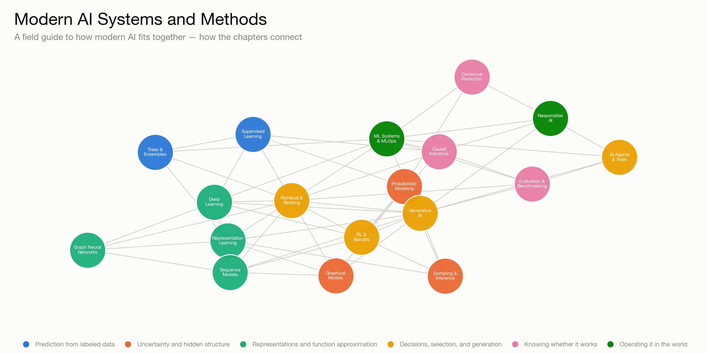

# Modern AI Systems and Methods



A field guide to how modern AI actually fits together — nineteen chapters
from supervised learning through agents, evaluation, and responsible AI, each
with real computed visualizations and each explicitly linked to the chapters
around it.

- Site: **[ioannisantoniadis.github.io/modern-ai-systems-and-methods](https://ioannisantoniadis.github.io/modern-ai-systems-and-methods/)**

## What this is

Most AI content is either a glossary (accurate, forgettable) or a hype piece
(memorable, thin). This tries for a third thing: explain the mechanism behind
each idea well enough that you could re-derive it, show it working on real —
if small — computed data instead of a decorative diagram, and be explicit
about how each idea depends on and feeds into its neighbors. A recommender
system is not "collaborative filtering" in isolation; it's supervised
ranking, matrix factorization, sequence modeling, bandit exploration, and
causal evaluation of biased logs, composed. This book tries to make that kind
of composition visible everywhere it happens.

## Contents

Start with [**the map**](https://ioannisantoniadis.github.io/modern-ai-systems-and-methods/chapters/00-landscape-and-map.html)
for the whole landscape in one page, including a real force-directed graph of
how every chapter connects to its neighbors. Then, grouped by the question
each part answers:

**Prediction from labeled data** — Supervised Learning · Trees, Ensembles, and Tabular ML

**Uncertainty and hidden structure** — Probabilistic Modeling · Graphical Models and Latent Variables · Sampling and Approximate Inference

**Representations and function approximation** — Representation Learning · Deep Learning Foundations · Sequence, Time-Series, and State Models · Graph Neural Networks

**Decisions, selection, and generation** — Reinforcement Learning and Bandits · Information Retrieval, Ranking, and Recommenders · Generative AI and Foundation Models · AI Agents, Tool Use, and Multi-Agent Systems

**Knowing whether it works** — Evaluation and Benchmarking · Causal Inference and Experimentation · Conformal Prediction

**Operating it in the world** — ML Systems and MLOps · Responsible, Private, and Robust AI

## Repository layout

```
docs/                 Quarto book — the site source
  _quarto.yml          book config, chapter order, theme
  chapters/*.qmd        the 19 chapters
  appendix-*.qmd        glossary, further reading
  images/                pre-generated static figures
scripts/figures/       one small standalone script per figure — real
                        computed output (numpy/scikit-learn/networkx/
                        matplotlib), not decorative diagrams
```

Every figure is a real computation on toy or synthetic data — a fitted
decision boundary, an MCMC trace, a value-iteration heatmap, a diffusion
process actually run forward and backward — generated by a short, readable
script in `scripts/figures/` and rendered as a static image. See
[`scripts/figures/README.md`](scripts/figures/README.md) to regenerate one.

## Building the site locally

Needs the [Quarto CLI](https://quarto.org/docs/get-started/) (no Python
execution is required to render — figures are pre-generated static assets):

```bash
quarto preview docs   # live-reloading local preview
quarto render docs    # one-shot build to docs/_site/
```

## License

MIT License. See [`LICENSE`](LICENSE).
